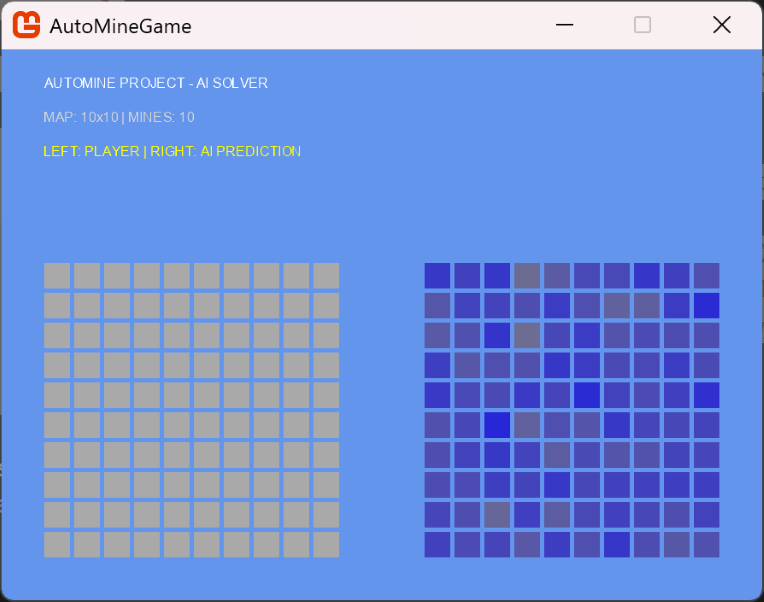

# AutoMine: 1부터 만드는 지뢰찾기 AI

**책 <밑바닥부터 시작하는 딥러닝>을 읽고, "지뢰찾기에 적용해보자"는 목표로 시작한 프로젝트입니다.**



## 프로젝트 소개

기존의 딥러닝 프레임워크(TensorFlow, PyTorch 등)를 사용하지 않고, **Python과 NumPy만으로** 직접 구현한 CNN 모델을 사용해 지뢰찾기를 수행하는 AI입니다.

지뢰찾기 게임 본체는 **C# (MonoGame)**으로 개발했고, AI 연산은 **Python**에서 돌아갑니다. 두 개의 서로 다른 프로그램이 실시간으로 통신하며 작동하는 구조를 만드는 데 집중했습니다.

## 개발 목표

1. **밑바닥부터(From Scratch):** 라이브러리에 의존하지 않고 신경망의 원리를 직접 코드로 구현해 이해하기.
2. **지하실부터(From the Basement):** (예정) Python보다 더 낮은 레벨인 **C++**로 신경망을 다시 구현해 성능 최적화 도전하기.

## 기술 스택

* **Game:** C# .NET 9.0, MonoGame (UI 및 게임 로직)
* **AI:** Python 3.x, NumPy (DeepConvNet 구현)
* **Communication:** 표준 입출력(Standard I/O)을 이용한 프로세스 간 통신

## 실행 방법

> **⚠️ 주의:** 현재 버전은 소스 코드 내에 파일 경로가 **절대 경로**로 하드코딩되어 있어, 다른 환경에서 실행하기 매우 번거롭습니다. **실행보다는 코드 리뷰를 권장드립니다.**

그럼에도 실행을 원하신다면 다음 절차를 따라주세요:

1. 이 저장소를 클론합니다.
2. Python 3.x와 `numpy`가 설치되어 있어야 합니다.
3. 소스 코드에서 아래 두 부분의 파일 경로를 본인의 환경에 맞게 직접 수정해야 합니다.
    * `AutoMine/AI/app.py` 내부의 `net.load_param` 경로
    * `AutoMine/Client/Game1.cs` (Initialize 함수) 내부의 `new AIProcessProxy()` 경로
4. `AutoMine/Client` 폴더에서 아래 명령어로 실행합니다.
    ```bash
    dotnet run
    ```

## 개발자 코멘트

경로 설정의 유연성을 확보하고 터미널 의존성을 줄이는 개선 작업을 진행할 예정입니다. 이후에는 C++을 도입하여 "지하실부터"의 구현으로 프로젝트를 확장해 나갈 계획입니다.

추가로, 자세한 개발 과정은 아래 블로그에 정리해 두었습니다.

https://velog.io/@levelstage/%EB%B0%91%EB%B0%94%EB%8B%A5%EB%B6%80%ED%84%B0-%EC%8B%9C%EC%9E%91%ED%95%98%EB%8A%94-%EC%A7%80%EB%A2%B0%EC%B0%BE%EA%B8%B0-%EC%9D%B8%EA%B3%B5%EC%A7%80%EB%8A%A5-%EA%B0%9C%EB%B0%9C-0-%ED%94%84%EB%A1%9C%EC%A0%9D%ED%8A%B8-%EA%B0%9C%EC%9A%94