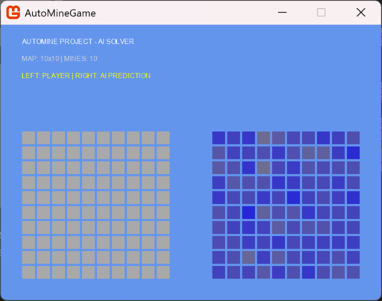

# AutoMine: 밑바닥부터 만드는 지뢰찾기 AI

> 딥러닝 프레임워크 없이, NumPy만으로 구현한 CNN이 지뢰찾기를 플레이합니다.



## 프로젝트 소개

[밑바닥부터 시작하는 딥러닝](https://www.hanbit.co.kr/store/books/look.php?p_code=B8475831198)을 읽고 **"지뢰찾기에 적용해보자"** 는 아이디어에서 시작한 프로젝트입니다.

TensorFlow, PyTorch 등의 프레임워크를 사용하지 않고 **Python + NumPy만으로 CNN을 직접 구현**했습니다. 게임 클라이언트는 **C# (MonoGame)** 으로 작성했고, 두 프로세스가 표준 입출력(stdio)으로 실시간 통신하는 구조입니다.

추가로, 연산 속도 향상을 위해 **Intel MKL 기반 C++ 확장 모듈**을 직접 작성해 NumPy 대비 행렬 연산 속도를 크게 개선했습니다.

자세한 개발 과정은 [블로그](https://velog.io/@levelstage/AutoMine0)에 정리되어 있습니다.

---

## 개발 목표

1. **밑바닥부터 (From Scratch):** 라이브러리에 의존하지 않고 신경망의 역전파, 합성곱 등 핵심 원리를 직접 코드로 구현해 이해하기 ✅
2. **지하실부터 (From the Basement):** Python보다 낮은 레벨인 **C++** 로 일부 핵심 연산을 재구현해 성능 최적화 도전하기 ✅
3. **실행 환경 수정하기:** 절대 경로 하드코딩 제거 및 빌드 환경 의존성 개선 🔄 (진행 중)

---

## 기술 스택

| 영역 | 기술 |
|---|---|
| 게임 클라이언트 | C# .NET 9.0, MonoGame |
| AI 추론 / 학습 | Python 3.x, NumPy |
| 연산 최적화 | Intel MKL (C++ → Python 확장 모듈) |
| 프로세스 간 통신 | 표준 입출력 (stdio) |

---

## 아키텍처

```
[C# 클라이언트]  ──stdin──▶  [Python AI 서버]
  게임판 상태                   추론 후 응답
  (10채널 one-hot)  ◀──stdout──  (칸별 안전도 확률 100개)
```

### 신경망 구조 (DeepConvNet)

```
입력: (N, 10, 10, 10)  ← 10채널 one-hot 인코딩
  │
  ├─ Conv2d (10 → 32)
  ├─ Conv2d (32 → 32)
  ├─ Conv2d (32 → 64)
  ├─ Conv2d (64 → 64)
  ├─ Affine (6400 → 256)  + ReLU
  ├─ Affine (256 → 100)
  └─ Sigmoid → Binary Cross Entropy Loss

출력: (N, 100)  ← 각 칸의 안전도 확률 (0=지뢰, 1=안전)
```

### 학습 데이터 생성

별도의 데이터셋 없이, `MsTeacher`가 게임을 직접 풀면서 학습 데이터를 **온라인으로 생성**합니다.
- 제약 충족(Constraint Satisfaction) 기반으로 각 칸의 안전 확률을 계산
- 논리적으로 확정된 칸(확률 0 또는 1)에는 손실 가중치를 5배 적용

---

## 프로젝트 구조

```
AutoMine/
│
├── AI/                     # Python AI 모듈
│   ├── app.py              # 게임과 통신하는 실시간 추론 서버
│   ├── MsDeep.py           # 모델 학습 스크립트
│   ├── MsTester.py         # 학습 결과 시각화 및 테스트
│   │
│   ├── Networks/           # 신경망 구현 (NumPy)
│   │   ├── network.py      # DeepConvNet 클래스
│   │   ├── layers.py       # Conv2d, Affine, ReLU, Sigmoid, BinaryCrossEntropy
│   │   ├── optimizer.py    # Adam 옵티마이저
│   │   └── utils.py        # im2col / col2im
│   │
│   ├── GameEngine/         # 지뢰찾기 게임 엔진 (Python)
│   │   └── MsEngine.py     # 칸 열기, BFS 체인 반응 등 게임 로직
│   │
│   └── Teacher/            # 학습 데이터 생성
│       └── teacher.py      # 제약 기반 확률 계산 및 데이터셋 생성
│
├── Client/                 # C# MonoGame 게임 클라이언트
│   ├── Game1.cs            # 메인 게임 루프
│   ├── Board.cs            # 게임판 상태 관리
│   ├── AIProcessProxy.cs   # Python 프로세스 실행 및 stdio 통신
│   └── ...
│
├── CppExtension/           # Intel MKL C++ 확장 모듈 (성능 최적화)
│   ├── mkl_mat.cpp         # MKL 기반 행렬 연산
│   ├── sycl_mat.cpp        # SYCL(GPU) 기반 행렬 연산 (실험적)
│   ├── CMakeLists.txt      # 빌드 설정
│   └── test_*.py           # NumPy 대비 성능 벤치마크
│
├── demo.gif
└── README.md
```

---

## 실행 방법

> **⚠️ 실행을 권장하지 않습니다.**
> Intel oneAPI 환경에서 C++ 확장 모듈(`mkl_mat.pyd`)을 직접 빌드해야 하고, 소스 코드 내 경로도 절대 경로로 하드코딩되어 있어 다른 환경에서 실행하기 매우 번거롭습니다.
